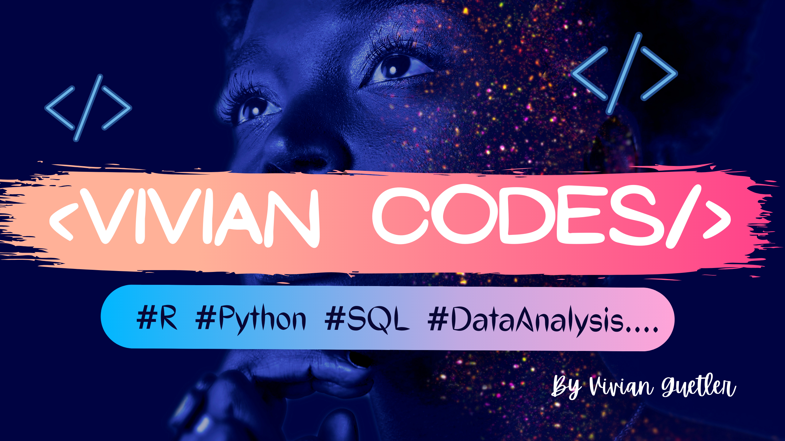

The following are some of data analysis and visualization projects done using Python and R.

# Vivian Codes 

YouTube live coding tutorials on various data analyis tasks in Python and R created for beginners. 

  
1

  
2

  
3

  
4

  
5

  

    <code>is-three-quarters-mobile</code> 
    <code>is-two-thirds-tablet</code> 
    <code>is-half-desktop</code> 
    <code>is-one-third-widescreen</code> 
    <code>is-one-quarter-fullhd</code>
  

  
2

  
3

  
4

  
5

<figure class="image is-128x128">
  
</figure>

<figure class="image is-16by9">
  <iframe class="has-ratio" width="640" height="360" src="<iframe width="560" height="315" src="https://www.youtube.com/embed/videoseries?list=PL6nx03_pduxWDrUoWCB-MaKBfRRSiIjlG" title="YouTube video player" frameborder="0" allow="accelerometer; autoplay; clipboard-write; encrypted-media; gyroscope; picture-in-picture" allowfullscreen></iframe>" frameborder="0" allowfullscreen></iframe>
</figure>